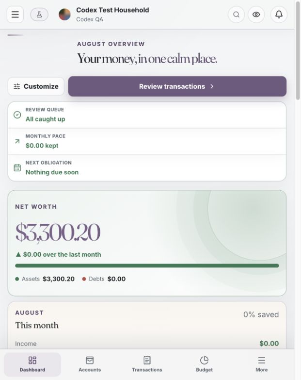
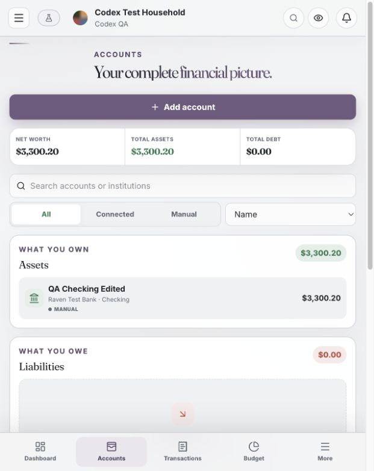
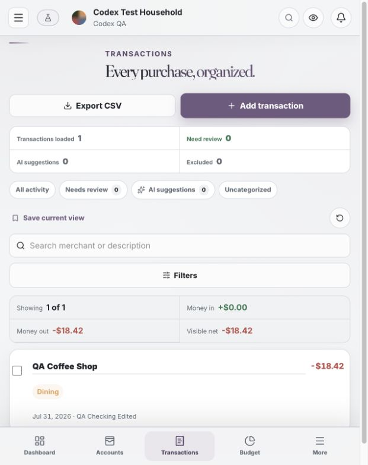
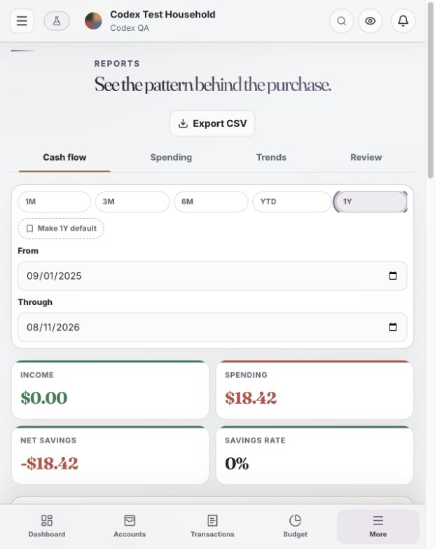

# Raven Ledger

[](https://github.com/MntDew1031/raven-ledger/actions/workflows/ci.yml)
[](https://github.com/MntDew1031/raven-ledger/releases)
[](LICENSE)

Raven Ledger is a self-hosted household finance application. It combines a
shared transaction ledger, account and net-worth tracking, category or flex
budgeting, recurring-item detection, cash-flow reporting, bank synchronization
through Plaid, and optional categorization suggestions from a local
OpenAI-compatible model.

The application is designed to run on infrastructure you control. PostgreSQL
stores the ledger, Redis handles sessions and background jobs, a FastAPI service
owns the API and migrations, an ARQ worker performs scheduled work, and a
Next.js frontend provides the browser UI.

> Raven Ledger is not a bank, accounting service, or regulated financial
> adviser. Review the code and your deployment before relying on it for
> financial decisions. Keep independent backups.

## Contents

- [Features](#features)
- [Screenshots](#screenshots)
- [Architecture](#architecture)
- [Fastest installation: Docker Compose](#fastest-installation-docker-compose)
- [Configuration reference](#configuration-reference)
- [Reverse proxy and HTTPS](#reverse-proxy-and-https)
- [First sign-in and household setup](#first-sign-in-and-household-setup)
- [Plaid bank connections](#plaid-bank-connections)
- [Optional local AI](#optional-local-ai)
- [Backups and restore](#backups-and-restore)
- [Upgrades and rollback](#upgrades-and-rollback)
- [TrueNAS](#truenas)
- [k3s and Kubernetes](#k3s-and-kubernetes)
- [Building and publishing container images](#building-and-publishing-container-images)
- [Local development](#local-development)
- [Troubleshooting](#troubleshooting)
- [Security notes](#security-notes)
- [License](#license)

## Features

- Multiple users with independent sign-ins and household-scoped roles.
- Invitation-only membership after the first owner creates the instance.
- Manual accounts and optional Plaid-linked accounts in one balance sheet.
- Assets, liabilities, net-worth snapshots, loans, holdings, and credit-card
  statement planning.
- Searchable transactions, splits, tags, bulk review, transfer matching, CSV
  import, reconciliation, and undo support.
- Editable category groups and deterministic merchant categorization rules.
- Category and flex budgets, rollover, non-monthly targets, income sources, and
  cash forecasting.
- Recurring bill, subscription, and income detection.
- Reports for spending, income, cash flow, net worth, and unusual activity.
- Disposable sandbox ledgers that never copy bank credentials.
- Read-only assistant context and proposal-based automation. The model does not
  receive a direct write tool.
- Named API keys with read-only or read/write scope.
- TOTP multi-factor authentication, recovery codes, session management, and a
  security activity timeline.
- Nightly PostgreSQL backups with verification and retention controls.
- Responsive browser UI and installable PWA assets.

## Screenshots

These views come from a synthetic demo household. Names, institutions,
transactions, and balances shown below are test data rather than real financial
information.

| Dashboard | Accounts |
| --- | --- |
|  |  |

| Transactions | Reports |
| --- | --- |
|  |  |

## Architecture

```text
browser
  |
  | HTTPS
  v
reverse proxy / ingress
  |
  v
Next.js frontend :3000
  |
  | /api/* on the private container network
  v
FastAPI backend :8000 -------- PostgreSQL :5432
  |                                |
  +------------ Redis :6379 -------+
                   |
                   v
                ARQ worker
                   |
                   +-- Plaid sync, recurring detection, categorization,
                       retention cleanup, and verified backups
```

Only the frontend should be reachable from outside the Docker or Kubernetes
network. PostgreSQL, Redis, and the backend API are internal services.

### Repository layout

```text
app/                    Next.js pages and global styles
components/             Shared React UI
lib/                    Browser-side API and formatting helpers
public/                 Icons and PWA assets
backend/app/            FastAPI application, models, routes, and services
backend/migrations/     Alembic database migrations
backend/tests/          Backend regression and security tests
database/schema.sql     Bootstrap schema for a new PostgreSQL volume
deploy/k3s/             Kubernetes manifests
deploy/truenas/         TrueNAS Custom App example
scripts/restore.sh      Interactive full-instance restore
docker-compose.yml      Production stack with source-build definitions
```

## Fastest installation: Docker Compose

### Requirements

- A Linux server or NAS capable of running Docker Engine and Docker Compose v2.
- At least 2 CPU cores, 2 GB RAM, and 10 GB free storage for a small household.
  Transaction history, database backups, and local container layers require
  additional space over time.
- A DNS name and HTTPS reverse proxy for production use.
- `git`, `python3`, and a POSIX shell for the commands below. Python is used
  only to generate cryptographically random configuration values.

The Compose file defaults to the project's public, version-pinned Docker Hub
images. You can instead build both application images from this checkout with
the source-build command shown below. PostgreSQL and Redis are downloaded from
their official public images in either case.

### Public Docker Hub images

Raven Ledger publishes ready-to-run application images publicly on Docker Hub.
They support both `linux/amd64` and `linux/arm64`, require no registry login to
pull, and are the default images used by `docker-compose.yml`:

- [Backend and worker](https://hub.docker.com/r/mntdew1031/raven-ledger-backend)
- [Frontend](https://hub.docker.com/r/mntdew1031/raven-ledger-frontend)

You may pre-pull the release before starting the stack:

```bash
docker pull docker.io/mntdew1031/raven-ledger-backend:1.76.2
docker pull docker.io/mntdew1031/raven-ledger-frontend:1.76.2
```

Manual pulls are optional. Running `docker compose up -d` later performs the
same pulls automatically and also starts PostgreSQL, Redis, the backend, the
worker, and the frontend with the required networks and persistent volumes.
The application images are not intended to be run alone without their service
configuration and dependencies.

### 1. Clone and enter the repository

```bash
git clone https://github.com/MntDew1031/raven-ledger.git
cd raven-ledger
```

### 2. Create the environment file

```bash
cp .env.example .env
chmod 600 .env
```

Generate three independent values:

```bash
python3 -c 'import secrets; print(secrets.token_urlsafe(32))'
python3 -c 'import secrets; print(secrets.token_urlsafe(48))'
python3 -c 'import base64,secrets; print(base64.urlsafe_b64encode(secrets.token_bytes(32)).decode())'
```

Put the first value in `POSTGRES_PASSWORD`, the second in
`RAVEN_SECRET_KEY`, and the third in `RAVEN_ENCRYPTION_KEY`.

The encryption key is a 44-character URL-safe Fernet key ending in `=`. Store
it in a password manager and in protected disaster-recovery documentation.
Losing or changing it makes existing encrypted Plaid access tokens unreadable.
It is intentionally not stored in database backups.

At minimum, also change:

```dotenv
FRONTEND_URL=https://finance.example.com
PLAID_WEBHOOK_URL=https://finance.example.com/api/v1/plaid/webhook
PLAID_REDIRECT_URI=https://finance.example.com/plaid/oauth
```

Use your real public HTTPS hostname. Leave Plaid credentials empty if you only
want manual accounts.

### 3. Validate the configuration

```bash
docker compose config --quiet
```

This catches missing required variables and YAML errors without starting the
application. The expanded output of `docker compose config` contains secrets;
do not paste it into issues or chat.

### 4. Start Raven Ledger

```bash
docker compose up -d
```

This pulls `mntdew1031/raven-ledger-backend:1.76.2` and
`mntdew1031/raven-ledger-frontend:1.76.2` when they are not already cached. To
compile the exact checkout locally instead, run:

```bash
docker compose up -d --build
```

The first local build can take several minutes. The backend waits for
PostgreSQL, runs all Alembic migrations, and then starts the API. The worker
starts after the backend is healthy, and the frontend starts last.

Watch startup:

```bash
docker compose ps
docker compose logs -f backend worker frontend
```

All five services should become `running`; PostgreSQL, Redis, backend, and
frontend should report healthy.

### 5. Open the application

For a temporary LAN-only test, browse to:

```text
http://SERVER_IP:3000
```

For this temporary HTTP test only, set these values before startup:

```dotenv
RAVEN_ENVIRONMENT=development
FRONTEND_URL=http://SERVER_IP:3000
COOKIE_SECURE=false
RAVEN_SESSION_COOKIE_NAME=raven_session
```

Do not expose development mode to the internet. Production must use HTTPS,
`RAVEN_ENVIRONMENT=production`, `COOKIE_SECURE=true`, and the
`__Host-raven_session` cookie name.

## Configuration reference

Compose reads `.env` from the repository root. Backend and worker settings must
match wherever both services use the same resource.

### Required production settings

| Variable | Purpose |
| --- | --- |
| `POSTGRES_DB` | PostgreSQL database name. Default: `raven`. |
| `POSTGRES_USER` | PostgreSQL application user. Default: `raven`. |
| `POSTGRES_PASSWORD` | Unique database password. URL-encode reserved characters if placing it in a manually written database URL. |
| `RAVEN_SECRET_KEY` | Random application/session secret, at least 32 characters. Do not reuse the database password. |
| `RAVEN_ENCRYPTION_KEY` | Dedicated Fernet key used for provider credentials and MFA material. Never rotate it without a data-migration plan. |
| `RAVEN_ENVIRONMENT` | Use `production` for an internet-accessible deployment. |
| `FRONTEND_URL` | Exact browser-facing origin, such as `https://finance.example.com`; no trailing path. |
| `COOKIE_SECURE` | Must be `true` behind production HTTPS. |
| `RAVEN_SESSION_COOKIE_NAME` | Use `__Host-raven_session` in production. |

Production startup fails closed when the application secret, encryption key,
or secure Plaid configuration is missing.

### Network and request settings

| Variable | Default | Notes |
| --- | --- | --- |
| `FRONTEND_PORT` | `3000` | Host port published by Compose. Change if the host port is occupied. |
| `TRUSTED_PROXY_CIDRS` | loopback plus common Docker private ranges | Only trust forwarded client IP headers from networks you control. Narrow this for your proxy network when possible. |
| `MAX_REQUEST_BODY_BYTES` | `8388608` | Maximum backend request body, bounded by the application to 64 KiB–64 MiB. |
| `SECURITY_EVENT_RETENTION_DAYS` | `365` | Nightly activity retention; accepted range is 30–3,650 days. |
| `ALLOW_PUBLIC_REGISTRATION` | `false` | The first owner can always bootstrap an empty instance. Afterwards, `false` requires invitations. |

### Redis authentication

Redis authentication is optional on the isolated Compose network. To enable
it, generate another random password and set both variables:

```dotenv
REDIS_PASSWORD=replace-with-a-random-value
RAVEN_REDIS_URL=redis://:URL_ENCODED_PASSWORD@redis:6379/0
```

Percent-encode characters that have meaning in a URL. Both backend and worker
must use the same URL.

### Backup and operator settings

| Variable | Default | Notes |
| --- | --- | --- |
| `BACKUP_KEEP` | `14` | Number of nightly dumps retained on the backup volume. |
| `RAVEN_OPERATOR_EMAILS` | empty | Comma-separated sign-in addresses allowed to manage instance-wide backups and settings. Empty keeps those browser endpoints closed. |

An operator can access data for every household through a database backup.
Grant this only to server administrators, not merely household owners.

### Optional image names

Compose uses the public versioned images by default. Override the names to pin
digests, test another release, or use your own registry:

```dotenv
BACKEND_IMAGE=docker.io/mntdew1031/raven-ledger-backend:1.76.2
FRONTEND_IMAGE=docker.io/mntdew1031/raven-ledger-frontend:1.76.2
```

Release `1.76.2` was published for `linux/amd64` and `linux/arm64`. For an
immutable deployment, pin the verified multi-architecture index digests:

```dotenv
BACKEND_IMAGE=docker.io/mntdew1031/raven-ledger-backend@sha256:e12b617fd9ea9a0de09ce738104b372a1b0035162e404c056733621221c86201
FRONTEND_IMAGE=docker.io/mntdew1031/raven-ledger-frontend@sha256:880615b629e937fa8fe57c1c375947af8e71e9b4759c5a1b22ae9747140eeef4
```

Docker Hub listings: [backend and worker](https://hub.docker.com/r/mntdew1031/raven-ledger-backend)
and [frontend](https://hub.docker.com/r/mntdew1031/raven-ledger-frontend).

Without digest overrides, `docker compose up --build` builds from the current
source and tags the results with the configured image names. See
[Building and publishing container images](#building-and-publishing-container-images)
for a registry workflow.

## Reverse proxy and HTTPS

Raven expects the browser and API to share one origin. Point the proxy at the
frontend only; Next.js forwards `/api/*` over the internal Docker network.

Set:

```dotenv
RAVEN_ENVIRONMENT=production
FRONTEND_URL=https://finance.example.com
COOKIE_SECURE=true
RAVEN_SESSION_COOKIE_NAME=__Host-raven_session
```

### Caddy example

```caddyfile
finance.example.com {
    encode zstd gzip
    reverse_proxy 127.0.0.1:3000
}
```

Caddy obtains and renews a public TLS certificate automatically when DNS and
ports 80/443 are configured correctly.

### Nginx example

```nginx
server {
    listen 443 ssl http2;
    server_name finance.example.com;

    # Configure ssl_certificate and ssl_certificate_key here.

    client_max_body_size 8m;

    location / {
        proxy_pass http://127.0.0.1:3000;
        proxy_http_version 1.1;
        proxy_set_header Host $host;
        proxy_set_header X-Real-IP $remote_addr;
        proxy_set_header X-Forwarded-For $proxy_add_x_forwarded_for;
        proxy_set_header X-Forwarded-Proto $scheme;
        proxy_set_header Upgrade $http_upgrade;
        proxy_set_header Connection "upgrade";
    }
}
```

Add ingress rate limiting appropriate to your environment. Never publish port
5432, 6379, or 8000. If a tunnel or proxy runs in another container network,
include only that network in `TRUSTED_PROXY_CIDRS`.

## First sign-in and household setup

On an empty database, `/register` creates the first household and its owner.
This bootstrap remains available even when `ALLOW_PUBLIC_REGISTRATION=false`.
As soon as any user exists, ordinary registration closes automatically.

Recommended first-run order:

1. Open `/register`, create the owner, and use a unique password of at least 12
   characters.
2. Enable TOTP MFA from Settings and save recovery codes offline.
3. Add a manual account to verify balances and sign conventions.
4. Invite other household members from Settings. Invitation links are
   single-use, email-bound, expiring capabilities; share them privately.
5. Configure budgets, categories, and rules before importing a large CSV.
6. If desired, configure Plaid in sandbox mode before requesting production
   access.

Income is positive, spending is negative, assets are positive, and liabilities
are negative. Transfers can be excluded from cash-flow and budget totals.

## Plaid bank connections

Plaid is optional. Manual accounts, CSV import, budgets, and reporting work
without it.

Start with sandbox credentials:

```dotenv
PLAID_ENVIRONMENT=sandbox
PLAID_CLIENT_ID=your-sandbox-client-id
PLAID_SECRET=your-sandbox-secret
PLAID_WEBHOOK_URL=https://finance.example.com/api/v1/plaid/webhook
PLAID_REDIRECT_URI=https://finance.example.com/plaid/oauth
PLAID_CONNECTION_LIMIT=
```

In the Plaid dashboard:

1. Add the exact HTTPS redirect URI shown above.
2. Configure the webhook URL.
3. Confirm the application name and allowed products.
4. Complete sandbox testing before changing `PLAID_ENVIRONMENT=production`.

Production mode refuses to start unless the client ID, secret, webhook URL,
and redirect URI are present and the URLs use HTTPS. The backend encrypts
access tokens before database storage. The backend and worker require the same
Plaid values and encryption key.

`PLAID_CONNECTION_LIMIT` is optional. Set it to the number of connections your
current Plaid plan permits if you want Raven to warn before the provider rejects
a new link.

## Optional local AI

Raven can use any reachable OpenAI-compatible `/v1` endpoint for category
suggestions and the assistant. Leave `LLM_BASE_URL` empty to disable it.

Example:

```dotenv
LLM_BASE_URL=http://llm-server:8080/v1
LLM_API_KEY=
LLM_MODEL=SP-gemma4:26b
LLM_TIMEOUT_SECONDS=120
LLM_MIN_BATCH_SIZE=4
```

The URL must be reachable from both backend and worker containers. `localhost`
inside a container means that container, not the Docker host. Use a resolvable
LAN hostname, an internal DNS record, or a service on a shared container
network. If the endpoint requires authentication, set `LLM_API_KEY`.

Small local models usually perform better with smaller batches; larger models
can use a larger value to reduce round trips. Raven lists model names reported
by the endpoint in Settings. Use an exact name that the gateway accepts.

Raven does not preload models or send periodic keep-alive prompts. Your model
server may unload an idle model and load the chosen one only when you test the
connection, request suggestions, or use the assistant.

Rules and deterministic categorization run before AI. Suggestions are limited
to existing category names and remain unreviewed until a person approves them.
Transaction descriptions are sent to the configured model endpoint, so treat
that endpoint as sensitive infrastructure.

## Backups and restore

The worker creates nightly PostgreSQL custom-format dumps in the `backup_data`
volume, writes a small JSON manifest, verifies the archive, and retains the
newest `BACKUP_KEEP` copies.

### Download or copy a backup

Configured operators can download backups in Settings. From the server, list
the volume contents with:

```bash
docker compose exec backend ls -lah /backups
```

Copy an archive and its manifest out of the container:

```bash
docker compose cp backend:/backups/raven-YYYYMMDDTHHMMSSZ.dump .
docker compose cp backend:/backups/raven-YYYYMMDDTHHMMSSZ.dump.json .
```

Keep at least one encrypted copy on another machine or storage provider. A
backup on the same disk is not disaster recovery.

### Restore an entire instance

The restore script is destructive: it stops the application, drops the current
database, recreates it, restores the dump, and restarts Raven.

```bash
./scripts/restore.sh ./raven-YYYYMMDDTHHMMSSZ.dump
```

Place the matching `.json` manifest beside the dump when available. The script
checks the encryption-key fingerprint and requires the database name as an
interactive confirmation.

Before restoring:

- snapshot or back up the current PostgreSQL volume;
- confirm `.env` contains the encryption key used by the archive;
- confirm the dump came from a compatible Raven release; and
- perform a practice restore on a disposable server.

## Upgrades and rollback

Before every upgrade:

1. Download a verified backup and preserve the current `.env`.
2. Record the current Git commit or release tag.
3. Read release notes and check for configuration changes.

Upgrade a source-build deployment:

```bash
git fetch --tags
git checkout RELEASE_TAG
docker compose build --pull
docker compose up -d
docker compose ps
docker compose logs --tail=200 backend worker frontend
```

The backend applies pending migrations before accepting traffic. Do not run
multiple backend versions against one database during an upgrade.

Application rollback is usually `git checkout PREVIOUS_TAG` followed by a
rebuild. Database migrations may not be backward-compatible. If the previous
application cannot use the upgraded schema, restore the pre-upgrade database
backup and the matching encryption key instead of guessing.

## TrueNAS

TrueNAS SCALE can run Raven Ledger as a Custom App. The root
`docker-compose.yml` uses named volumes and defaults to the published,
version-pinned application images; pass `--build` from a Git checkout to build
them locally instead. For persistent TrueNAS datasets and a paste-ready image
deployment, use `deploy/truenas/custom-app.yaml.example` as the starting point.

Before pasting the example:

1. Replace every `REPLACE_WITH_...` placeholder. Plaid and local AI remain
   disabled in the example until you deliberately configure them.
2. Change `finance.example.com` to your hostname.
3. Change `/mnt/main/raven-ledger/...` to datasets that exist on your pool.
4. Give the backend container user write access to the backup dataset. The
   current Alpine image uses UID 100 / GID 101 for the `raven` system user.
5. Keep PostgreSQL, Redis, and backups on persistent datasets.
6. Send your reverse proxy or tunnel to the frontend port only.

An image update should replace containers, not datasets. Never let an app
upgrade silently create new empty host paths beside the old data.

## k3s and Kubernetes

The numbered manifests in `deploy/k3s/` provide a baseline for k3s with
Traefik. They include PostgreSQL, Redis, backend, worker, frontend, persistent
volume claims, services, and an HTTPS ingress.

The manifests use the project's public versioned Docker Hub images. Change the
image references if you publish a fork or want to pin immutable digests.

Prepare configuration:

```bash
cp deploy/k3s/01-secrets.example.yaml deploy/k3s/01-secrets.local.yaml
```

Edit the local secret file and `02-config.yaml`, then change the hostname and
TLS secret in `09-ingress.yaml`. Keep the local secret file out of Git.

Apply in order:

```bash
kubectl apply -f deploy/k3s/00-namespace.yaml
kubectl apply -f deploy/k3s/01-secrets.local.yaml
kubectl apply -f deploy/k3s/02-config.yaml
kubectl apply -f deploy/k3s/03-storage.yaml
kubectl apply -f deploy/k3s/04-postgres.yaml
kubectl apply -f deploy/k3s/05-redis.yaml
kubectl apply -f deploy/k3s/06-backend.yaml
kubectl apply -f deploy/k3s/07-worker.yaml
kubectl apply -f deploy/k3s/08-frontend.yaml
kubectl apply -f deploy/k3s/09-ingress.yaml
```

Verify:

```bash
kubectl -n raven-ledger get pods,svc,ingress,pvc
kubectl -n raven-ledger logs deployment/backend --tail=200
kubectl -n raven-ledger logs deployment/worker --tail=200
```

Adapt storage classes, access modes, resource limits, ingress annotations,
network policies, secret management, and backup export to your cluster. The
included backup PVC uses `ReadWriteMany` so backend and worker can mount it;
some single-node clusters can use `ReadWriteOnce` when both pods stay on the
same node.

## Building and publishing container images

Build clean images from this sanitized source tree:

```bash
docker build --pull -f backend/Dockerfile -t raven-ledger-backend:1.76.2 .
docker build --pull -f Dockerfile.frontend -t raven-ledger-frontend:1.76.2 .
```

Both builds use the root `.dockerignore`; virtual environments, dependency and
build directories, caches, bytecode, local environment files, and agent
instruction files are excluded. Both runtime images include `LICENSE` and
`NOTICE` and run as unprivileged users.

Inspect before publishing:

```bash
docker image inspect raven-ledger-backend:1.76.2
docker image inspect raven-ledger-frontend:1.76.2
docker history --no-trunc raven-ledger-backend:1.76.2
docker history --no-trunc raven-ledger-frontend:1.76.2
```

Confirm there are no secrets, private URLs, personal filesystem paths, `.env`
files, Git metadata, caches, or agent instruction files. Run a container image
scanner available in your CI environment and review its findings before push.

For a multi-architecture registry release:

```bash
docker buildx create --use --name raven-builder

docker buildx build \
  --platform linux/amd64,linux/arm64 \
  --file backend/Dockerfile \
  --tag docker.io/mntdew1031/raven-ledger-backend:1.76.2 \
  --tag docker.io/mntdew1031/raven-ledger-backend:latest \
  --push .

docker buildx build \
  --platform linux/amd64,linux/arm64 \
  --file Dockerfile.frontend \
  --tag docker.io/mntdew1031/raven-ledger-frontend:1.76.2 \
  --tag docker.io/mntdew1031/raven-ledger-frontend:latest \
  --push .
```

Use lowercase registry account names. Prefer immutable version tags or digests
in k3s and TrueNAS; reserve `latest` for convenience, not reproducibility.

## Local development

### Frontend

Requirements: Node.js 24 and npm.

```bash
npm ci
npm run dev
```

The frontend runs at `http://localhost:3000`. It expects the backend at
`http://backend:8000` unless `API_INTERNAL_URL` is overridden. For host-based
development:

```bash
API_INTERNAL_URL=http://127.0.0.1:8000 npm run dev
```

Frontend verification:

```bash
npm run lint
npm run build
```

### Backend

Requirements: Python 3.13, PostgreSQL, and Redis.

```bash
cd backend
python3 -m venv .venv
. .venv/bin/activate
python -m pip install -r requirements-dev.txt
ruff check .
python -m pytest
```

Set development `DATABASE_URL`, `REDIS_URL`, and `SECRET_KEY` values, then run:

```bash
alembic upgrade head
uvicorn app.main:app --reload
```

Interactive API documentation is available at `http://127.0.0.1:8000/docs` in
development. Production disables the docs and OpenAPI routes.

Run the complete frontend check from the repository root with:

```bash
npm test
```

## Troubleshooting

### Backend exits with “Unsafe production configuration”

One or more required production values is absent or unsafe. Check
`RAVEN_SECRET_KEY`, `RAVEN_ENCRYPTION_KEY`, `FRONTEND_URL`, and—when Plaid is in
production mode—the Plaid credentials and HTTPS URLs.

```bash
docker compose logs backend
```

### Browser loops back to sign-in

Confirm the public URL exactly matches `FRONTEND_URL`, HTTPS reaches the
frontend, `COOKIE_SECURE=true`, and the cookie name is
`__Host-raven_session`. Clear stale `raven_session` cookies after changing from
development to production.

### Frontend reports that Raven is temporarily unavailable

The frontend could not validate the session with the backend within three
seconds. Check service health and the internal URL:

```bash
docker compose ps
docker compose logs --tail=200 backend frontend
docker compose exec frontend wget -qO- http://backend:8000/health
```

### Worker is offline or syncs never complete

Check Redis connectivity and worker logs. Backend and worker must share the
same Redis URL, database URL, encryption key, and optional Plaid/AI settings.

```bash
docker compose logs --tail=300 worker redis
```

### Plaid OAuth returns to the wrong page

`PLAID_REDIRECT_URI` must exactly equal an allowed URI in the Plaid dashboard,
including scheme, hostname, port, and `/plaid/oauth` path. The webhook URL is a
different endpoint ending in `/api/v1/plaid/webhook`.

### Local AI works on the host but not in Raven

Do not use `127.0.0.1` or `localhost` unless the model runs in the same
container. Test the model URL from backend and worker networks and check host
firewall rules. Verify `LLM_MODEL` is an exact model name accepted by the
endpoint.

### A fresh database appeared after a move

Stop immediately. Verify the named volume or TrueNAS dataset mount points.
Starting with a different Compose project name can create a new named volume.
Do not delete either volume until you identify which contains the real data.

### Restore warns that the encryption key does not match

Use the original `RAVEN_ENCRYPTION_KEY` from protected recovery documentation.
Continuing with another key restores ordinary financial data but existing
Plaid connections and encrypted MFA material cannot be decrypted.

## Security notes

- Keep `.env`, Kubernetes Secret manifests, database dumps, logs containing
  household data, and local agent instructions out of Git.
- Use unique random values for database, Redis, session, and encryption
  secrets.
- Expose only the HTTPS frontend through a trusted reverse proxy.
- Keep registration closed after bootstrap and distribute invitation links
  privately.
- Enable MFA for owners and server operators.
- Grant `RAVEN_OPERATOR_EMAILS` sparingly; instance backups cross household
  boundaries.
- Patch base images and application dependencies regularly.
- Test restores. A backup that has never been restored is only an assumption.
- Review [SECURITY.md](SECURITY.md) before reporting a vulnerability.

Raven Ledger stores highly sensitive data. Self-hosting gives you control, and
also makes patching, access control, TLS, monitoring, and recovery your
responsibility.

## License

Raven Ledger is licensed under the [Apache License 2.0](LICENSE). You may use,
modify, and redistribute the software, including commercially, subject to the
license conditions. Preserve the license and applicable notices, identify
modified files, and do not use contributor names or project trademarks to imply
endorsement. The license includes an express patent grant and provides the
software without warranties. See [NOTICE](NOTICE) for the accompanying notice.
